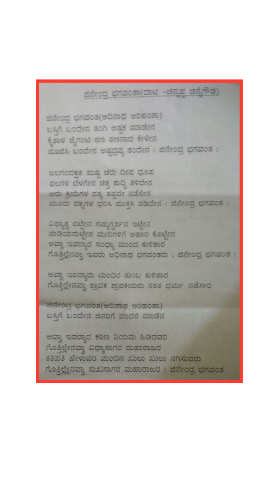

# ಜಿನೇಂದ್ರ ಭಗವಂತ । ಆದಿನಾಥ ಅರಿಹಂತ ।। जिनेंद्र भगवंत । आदिनाथ अरिहंत ।। Jinendra Bhagawanta । Aadinatha Arihanta ।।

[
    ೯೪ ವರುಷದ ಮುನಿ ಸಂಯಮಸಾಗರ ರವರ ಮದುರ ಧ್ವನಿಯಿಂದ:  
    मुनि संयमसागर जी की मधुर आवाज़ में:  
    94 years old Muni Sayamasagara's beautiful voice:  
](https://www.facebook.com/AcharyaVidyasagarJi/videos/1694386503936795/?hc_ref=NEWSFEED)

---

<!-- TOC -->

- [ಜಿನೇಂದ್ರ ಭಗವಂತ । ಆದಿನಾಥ ಅರಿಹಂತ ।। जिनेंद्र भगवंत । आदिनाथ अरिहंत ।। Jinendra Bhagawanta । Aadinatha Arihanta ।।](#%E0%B2%9C%E0%B2%BF%E0%B2%A8%E0%B3%87%E0%B2%82%E0%B2%A6%E0%B3%8D%E0%B2%B0-%E0%B2%AD%E0%B2%97%E0%B2%B5%E0%B2%82%E0%B2%A4-%E0%A5%A4-%E0%B2%86%E0%B2%A6%E0%B2%BF%E0%B2%A8%E0%B2%BE%E0%B2%A5-%E0%B2%85%E0%B2%B0%E0%B2%BF%E0%B2%B9%E0%B2%82%E0%B2%A4-%E0%A5%A4%E0%A5%A4-%E0%A4%9C%E0%A4%BF%E0%A4%A8%E0%A5%87%E0%A4%82%E0%A4%A6%E0%A5%8D%E0%A4%B0-%E0%A4%AD%E0%A4%97%E0%A4%B5%E0%A4%82%E0%A4%A4-%E0%A5%A4-%E0%A4%86%E0%A4%A6%E0%A4%BF%E0%A4%A8%E0%A4%BE%E0%A4%A5-%E0%A4%85%E0%A4%B0%E0%A4%BF%E0%A4%B9%E0%A4%82%E0%A4%A4-%E0%A5%A4%E0%A5%A4-jinendra-bhagawanta-%E0%A5%A4-aadinatha-arihanta-%E0%A5%A4%E0%A5%A4)
    - [ಕನ್ನಡ ( कन्नड़ / Kannada )](#%E0%B2%95%E0%B2%A8%E0%B3%8D%E0%B2%A8%E0%B2%A1-%E0%A4%95%E0%A4%A8%E0%A5%8D%E0%A4%A8%E0%A5%9C-kannada)
        - [Another version of the song](#another-version-of-the-song)
    - [हिंदि ( ಹಿಂದಿ / Hindi )](#%E0%A4%B9%E0%A4%BF%E0%A4%82%E0%A4%A6%E0%A4%BF-%E0%B2%B9%E0%B2%BF%E0%B2%82%E0%B2%A6%E0%B2%BF-hindi)
    - [English ( ಆಂಗ್ಲ )](#english-%E0%B2%86%E0%B2%82%E0%B2%97%E0%B3%8D%E0%B2%B2)
        - [Words Meaning](#words-meaning)
        - [Words Meaning](#words-meaning)
        - [Meaning](#meaning)
        - [Words Meaning](#words-meaning)
        - [Meaning](#meaning)
        - [Words Meaning](#words-meaning)
        - [Meaning](#meaning)
        - [Words Meaning](#words-meaning)
        - [Meaning](#meaning)
        - [Words Meaning](#words-meaning)
        - [Meaning](#meaning)

<!-- /TOC -->

## ಕನ್ನಡ ( कन्नड़ / Kannada )

```
ಜಿನೇಂದ್ರ ಭಗವಂತ । ಆದಿನಾಥ ಅರಿಹಂತ ।।  
ಜಿನೇಂದ್ರ ಭಗವಂತ । ಆದಿನಾಥ ಅರಿಹಂತ ।।  
ಬಸ್ದಿಗೆ ಬಂದೇನೇ । ಜಿನ ??? ಮಾಡೇನ ।।  
ಬಸ್ದಿಗೆ ಬಂದೇನೇ । ಜಿನ ??? ಮಾಡೇನ ।। ಪ ।।  
```

```
ಮಿಥ್ಯಾತ್ವ ಬಿಟ್ಟೇನೆ । ಸಮ್ಯಕ್ ದರ್ಶನ ಧರಿಸೇನೆ ।।  
ಮಿಥ್ಯಾತ್ವ ಬಿಟ್ಟೇನೆ । ಸಮ್ಯಕ್ ದರ್ಶನ ಧರಿಸೇನೆ ।।  
ಮಡಿಯ ಉಟ್ಟೇನೇ । ಮುನಿಗಳಿಗೆ ಆಹಾರ ಕೊಟ್ಟೇನೆ ।।  
ಮಡಿಯ ಉಟ್ಟೇನೇ । ಮುನಿಗಳಿಗೆ ಆಹಾರ ಕೊಟ್ಟೇನೆ ।। ಜಿನೇಂದ್ರ ಭಗವಂತ...  
```

```
ಆರು ಕ್ರಿಯೆಗಳ । ನಿತ್ಯ ತಪ್ಪನೆ ಮಾಡನೇ ।।  
ಆರು ಕ್ರಿಯೆಗಳ । ನಿತ್ಯ ತಪ್ಪನೆ ಮಾಡನೇ ।।  
ಮೂರೂ ರತ್ನಗಳ ಧರಿಸಿ । ಮುಕ್ತಿಗೆ ಹೋದೆನೇ ।।  
ಮೂರೂ ರತ್ನಗಳ ಧರಿಸಿ । ಮುಕ್ತಿಗೆ ಹೋದೆನೇ ।। ಜಿನೇಂದ್ರ ಭಗವಂತ...  
```

### Another version of the song



---

## हिंदि ( ಹಿಂದಿ / Hindi )

```
जिनेन्द्र भगवंत । आदिनाथ अरिहंत ।।  
जिनेन्द्र भगवंत । आदिनाथ अरिहंत ।।  
बसदिगे बन्देने । जिन ??? माडेना ।।  
बसदिगे बन्देने । जिन ??? माडेना ।। प ।।  
```
```
मित्यत्व बिट्टेने । सम्यक दर्शन दरिसेने ।।  
मित्यत्व बिट्टेने । सम्यक दर्शन दरिसेने ।।  
मडीय उट्टेने । मुनिगलिगे आहार कोट्टेने ।।  
मडीय उट्टेने । मुनिगलिगे आहार कोट्टेने ।। जिनेन्द्र भगवंत...  
```
```
आरु क्रियेगल । नित्य तप्पने मादेने ।।  
आरु क्रियेगल । नित्य तप्पने मादेने ।।  
मुरू रत्नगला धरिसि । मुक्तिगे होदेने ।।  
मुरू रत्नगला धरिसि । मुक्तिगे होदेने ।। जिनेन्द्र भगवंत...  
```

---


## English ( ಆಂಗ್ಲ )

```
Jinendra Bhagawanta । Aadinatha Arihanta ।।  
Jinendra Bhagawanta । Aadinatha Arihanta ।।  
```

### Words Meaning

Jinendra = Jina + Indra i.e., king of jinas => [Tirthankara](https://en.wikipedia.org/wiki/Tirthankara); Bhagawan = God; [Aadinatha](https://en.wikipedia.org/wiki/Rishabhanatha) = First Tirthankara; [Arihanta](https://en.wikipedia.org/wiki/Arihant_%28Jainism%29) = Sould who has conquered all inner karmas)  

```
Basadige bandene । jina ??? kalitene ।।  
Basadige bandene । jina ??? kalitene ।। P ।।  
```

### Words Meaning

[Basadi](https://en.wikipedia.org/wiki/Jain_temple) = Jain Temple; Ge = To; Bandena = Came; Kalitena = To Learn )  

### Meaning

Coming to Jain Temple । Learning Jina ??? ।। 

```
Mityatva Bittene । Samyak Darshana Dharisene ।।  
Mityatva Bittene । Samyak Darshana Dharisene ।।  
```

### Words Meaning

Mityatva = False; Bittene = Leave; Samyak = Right; Darshana = Perception; Dharisene = Wear  

### Meaning

Leaving the false perception । Wearing (adapting) the right perception ।। 

```
Madiya uttene । Munigalige aahara kottene ।।  
Madiya uttene । Munigalige aahara kottene ।। Jinendra Bhagawanta...  
```

### Words Meaning

Madiya = Clean washed clothes which are mainly used for doing puja/abhisheka; Uttena = Wore; [Muni](https://en.wikipedia.org/wiki/Digambara_monk) = Digambara Monk; Munigalu = Digambara Monks; Ge = To; Munigalige = To Digambara Monks; Aahara = Food; Kottene = Gave   

### Meaning

Wearing clean clothes । Giving food to muni ।।   

```
Aaru kriyegala । Nitya tappane maadene ।।  
Aaru kriyegala । Nitya tappane maadene ।।  
```

### Words Meaning

Aaru = 6; Kriye = action; Kriyegalu = actions; Nitya = Everyday; tappane = Without missing; Maadene = Do 

### Meaning

Doing 6 actions everyday without missing them।। 6 jain shravak actions - Deva pooja, Guru seva, Swadhyaya, Samyama, Tapa, Dana

```
Muruu ratnagala dharisi । Muktige hodene ।।  
Muruu ratnagala dharisi । Muktige hodene ।। Jinendra Bhagawanta...  
```

### Words Meaning

Muruu = 3; Ratna = Jewel; Ratnagala = Jewels; Dharisi = Wear; Mukti = Liberation; Ge = To; Muktige = To Liberation; Hodene = Go/went)  

### Meaning

Wearing 3 jewels। heading towards liberation ।। 
3 jewels of jainism - Samyak Darshan, Samyak Jnaan, Samyak Charitra)  

---
